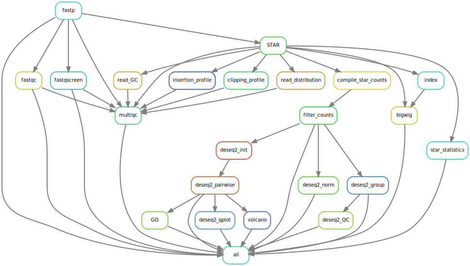

[](https://travis-ci.com/ohsu-cedar-comp-hub/Bulk-RNA-seq-pipeline-PE)[](https://svgshare.com/i/Zhy.svg)

# Bulk-RNA-seq-pipeline-PE

Pipeline to run basic RNA-seq analysis on paired-end data.

This is a package of Python and R scripts that enable reading, processing and analysis of Omics' datasets. 
This package implements the Snakemake management workflow system and is currently implemented to work with 
the cluster management and job scheduling system SLURM. This snakemake workflow utilizes conda installations to download and use packages for further analysis, so please ensure that you have installed miniconda prior to use.

Features unique to the MaxsonBraunLab fork
======================

```
Decrease dependence on CEDAR software.

1. install STAR 2.7.1a using conda
2. fastq screen config file refers to Maxson Lab builds
3. copied geneAnno files to local pipeline for biotype filtration. geneID2GO files for GO, and geneAnno files for biotype filter.
4. copied /home/groups/CEDAR/estabroj/beta4/data/mm10_MGC_gene.bed to local pipeline for rseqc read_distribution metric.
5. point indices and gtfs to maxson lab
6. better documentation in omic_config.yaml

Pipeline fixes / tailor to Maxson Data

7. pipeline is now organism agnostic
8. biotype filtration now works
9. mitochondrial gene filtration will now grep for "^MT-" while ignoring case. Good for mm10.
11. FC for GO is now a raw number filter. Previous pipeline used log2(FC) filter.

```

# 1. Prepare your work environment

```
# clone this repo to a new working directory

git clone git@github.com:maxsonBraunLab/Bulk-RNA-seq-pipeline-PE.git
cd Bulk-RNA-seq-pipeline-PE/samples/raw

# symlink your FASTQ files (gzipped) to this directory
for file in (find <absolute/path/to/relevant/folder> -name "*.gz" | sort); do
    echo "symlinking $file"
    ln -s $file .
done

# rename symlinks to match the following format: {sample}_{R1|R2}.fastq.gz
mv sample1_1.fq.gz sample1_R1.fastq.gz
mv sample1_2.fq.gz sample1_R2.fastq.gz

```

# 2. Prepare your conda environment

Continue forward if you don't have a conda environment with a clean install of snakemake.

```
# while using base conda env, create your snakemake environment
conda install -c conda-forge mamba # installs into base env
mamba create -c conda-forge -c bioconda -n snakemake snakemake # installs snakemake into new env

conda activate snakemake
```

# 3. Tailor the `omic_config.yaml` file to your analysis

The `omic_config.yaml` file is used to customize the pipeline to your experiment. The pipeline requires STAR indices made using STAR 2.7.1a, and the current configuration uses Ensembl genomes and annotations.

The `omic_config.yaml` file can also adjust for differential expression.

To relate sample to covariates (e.g. condition), please fill out the `data/metadata.txt` file. If your only independent variable to analyze is treatment/condition, then the file would be a 2-column TSV file with "SampleID" and "Condition" as the headers. Additional headers (Lane, time points, etc.) can be recognized and plotted by specifying them in the `omic_config.yaml` file. These include the `meta_columns_to_plot`, `pca_labels`, `sampleID`, and `Type` keys.

# 4. Set up SLURM integration

Continue forward if you don't have a [SLURM profile](https://github.com/Snakemake-Profiles/slurm).

Download the `slurm` folder from this [repository](https://github.com/gartician/slurm-snakemake-profile) and copy the entire thing to `~/.config/snakemake`. 

# 5. Run the pipeline

First do a dry-run of snakemake to ensure proper execution before submitting it to the cluster.

```
$ snakemake -np --verbose
```

Once your files are symbolically linked, you can submit the jobs batch-style to exacloud via your terminal window. This is most appropriate when running many heavy processes like read alignment.

```
$ snakemake -j <n jobs> --use-conda --profile slurm --cluster-config cluster.yaml
```

To see how the job is running, look at your queue.

```
$ squeue -u your_username
```

If you need to re-run light processes such as differential expression and quality control, just remove the profile and cluster-config flags like this:

```
$ snakemake -j <n cores> --use-conda
```

`j` in this 'interactive' context means to use `n` amount of local cores, while the 'batch' context specifies number of active jobs!

Detailed Workflow
=================================



Alignment
======================
1) Trimming
    * Trimming of paired-end reads was performed using fastp.
2) Quality Analysis
    * Trimmed reads were subject to `fastqc` quality analysis
    * The output is located in `samples/fastqc/{sample}/`
3) Alignment
    * Trimmed reads were aligned to the hg38 genome assembly using `STAR`
        * We included a two pass mode flag in order to increase the number of aligned reads
        * Output is placed in `samples/star/{sample}_bam/`
            * Output directory includes: `Aligned.sortedByCoord.out.bam`, `ReadsPerGene.out.tab`, and `Log.final.out`
    * We extracted the statistics from the `STAR` run, and placed them in a table, summarizing the results across all samples from the `Log.final.out` output of STAR
        * Output is `results/tables/{project_id}_STAR_mapping_statistics.txt`
4) Summarizing output
    * `htseq` is used to extract the gene counts from each sample
    * We summarize these results into 1 table, which includes the gene counts across all samples
    * The output is located in `data/{project_id}_counts.txt`

Quality Analysis / Quality Check
======================
1) RSEQC Quality check 
    * `RSEQC` was used to check the quality of the reads by using a collection of commands from the `RSEQC` package:
        * Insertion Profile
        * Inner Distance
        * Clipping Profile
        * Read distribution
        * Read GC
    * For more information on these, visit: http://dldcc-web.brc.bcm.edu/lilab/liguow/CGI/rseqc/_build/html/index.html#usage-information
    * Output directory: `rseqc/`
2) QA/QC scripts to analyze the data as a whole 
    * The purpose of this analysis is to identify potential batch effects and outliers in the data
    * The outputs to this are located in the `results` directory, and are distributed amongst 4 subdirectories, numbered `1 through 4`
        * `1`
            * A *boxplot* of the raw log2-transformed gene counts across all samples
            * A *boxplot* of the loess-transformed gene counts across all samples
            * A *scatter plot* comparing raw gene counts to loess-transformed gene counts
            * A *density plot* of raw log2-transformed gene counts across all samples 
            * A *density plot* of loess-transformed gene counts across all samples
            * A *scatter plot* of the standard deviation of raw log2-transformed gene counts across all samples
            * A *scatter plot* of the standard deviation of loess-transformed gene counts across all samples
        * `2`
            * A *heatmap* of all raw log2-transformed gene counts across samples
            * A *heatmap* of all loess-transformed gene counts across samples
                * These are generated to look for any batch effects in the data, due to date of extraction, or other factors
            * An *MDS Plot* for all samples, generated with the raw log2-transformed gene counts
            * An *MDS Plot* for all samples, generated with the loess-transformed gene counts
                * These are generated to look for outliers in the data
        * `3`
            * *p-value histograms* for each contrast specified in the `omic_config.yaml`
            * *q-value QC plot arrays* for each contrast specified in the `omic_config.yaml`
        * `4`
            * A *Heatmap* which looks at genes with a high FC and low q-value (very significant)
                * Takes genes with a FC>1.3, and ranks those by q-value. From this, a heatmap is generated for the top *50, 100 and 200* genes in this list
            * An *MDS Plot* which looks at the same subsets of genes as the Heatmap described above

Differential Expression Analysis (DESeq2)
======================
1) Initializing the DESeq2 object
    * Here, we run `DESeq2` on the genecounts table, which generates an RDS object and rlog
        * This includes the DE analysis across all samples
        * Output is located in the `results/diffexp/ directory`
    * From the dds object generated, we extract the normalized counts and generate a table with the results
        * Output is `results/tables/{project_id}_normed_counts.txt`
2) Generating plots
    * From the RDS object, we generate a collection of informative plots. These include:
        * *PCA Plot*
        * *Standard Deviation from the Mean Plot*
        * *Heatmap*
        * *Variance Heatmap*
        * *Distance Plot*
3) Differential Expression Analysis
    * We perform Differential Expression (DE) analysis for each contrast listed in the `omic_config.yaml`
    * Our output consists of DE gene count tables and a variety of plots
        * A table is generated for genes that are differentially expressed for each contrast
            * The output is placed in `results/diffexp/{contrast}.diffexp.tsv`
        * *MA Plots* are generated for each contrast
        * *p-histograms* are generated for each contrast
4) Differential Expression Plots
    * We use the output from DESeq2 to generate two types of plots:
        * Gene Ontology (GO) plots:
            * A `tree graph` describing the GO ID relationship for significantly up/downregulated genes in a given comparison
                * Output is located in `results/diffexp/GOterms`
            * A `bar graph` describing the enrichment and significance of GO IDs for up/downregulated genes in a given comparison
        * Volcano plots:
            * A `volcano plot` describing the distribution of up/downregulated genes in a given comparison
                * Output is located in `results/diffexp`

